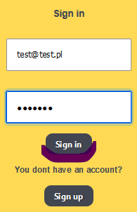
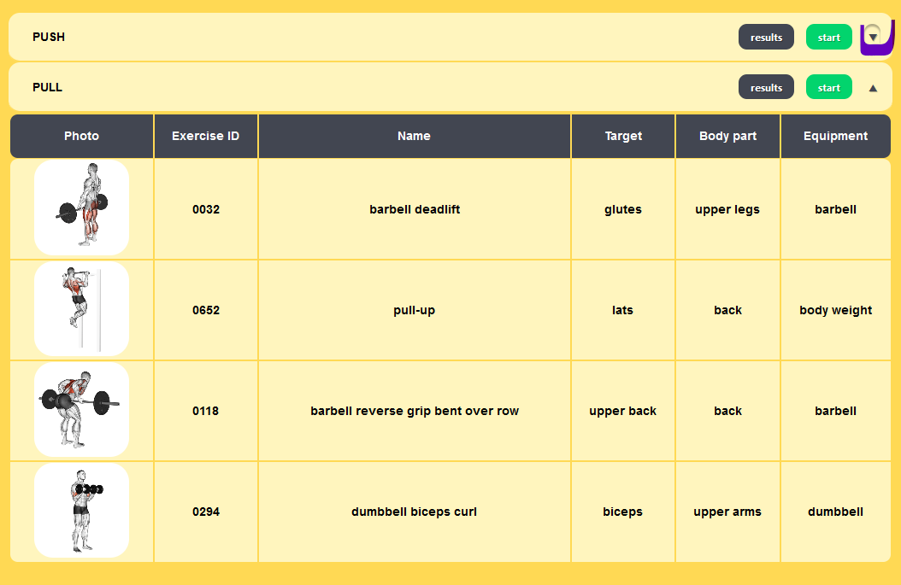
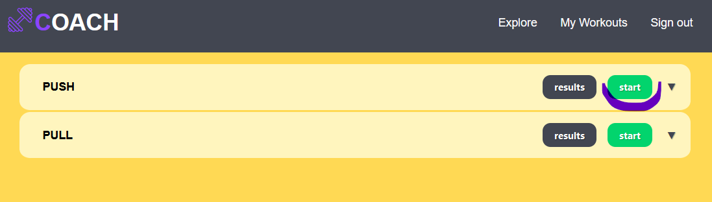
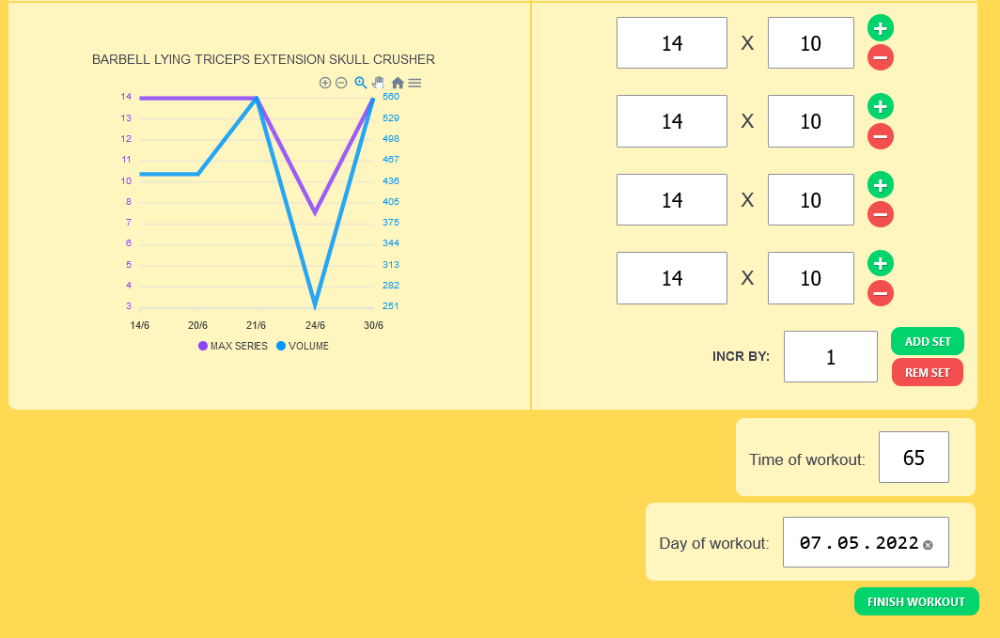

# COACH

*Web application dedicated to weightlifting training progress monitoring and analysis.*

## Table of contents
* [General info](#general-info)
* [Basic Flow](#basic-flow)
* [Tech stack](#technologies)
* [Inspirations](#inspirations)
* [Project Setup](#project-setup)
* [Assets used](#assets-used)
* [Stuff to implement in the future](#stuff-to-implement-in-the-future)

## General info
I wrote this app for purpose of learning Vue 3, typescript, scss, and unit testing.
I used composition api for adjusting screen resolution of some components (f.e. Chart)
and input validation. I used it also for creating middleware for router and vuex store for clean code purposes.
For storing data I have chosen firebase. It let me focus on frontend and same app idea development, rather than rearranging relations.
Right now the representative fragment is do-exercise-table
component. It contains my reusable workout-result-chart and exercise-result-creation-fragment,
which handles collecting store data about workout results and subcontract exercise-result-set
for computing each set result values.

## Basic Flow
**If You want to fell what I'm writing above, just go to **https://nitkiewiczartur.github.io/coach** and log in with the credentials below...**
```
email: test@test.pl
password: test123
```

<br>
**... if You are not sure which workout suits You today, You can check it's details here...**



**... then pick the workout, that You want to do today by pressing start (push workout is filled with some data already) ...** 

<br>

**... and here we go! Now you can fill the form with Your workout results and save it.
Don't forget to check your long term progress in results view!!**



## Technologies
* [Vue 3 with TypeScript](https://vuejs.org/)

* [Node.js 16.13.1](https://nodejs.org/en/)

* [Firebase](https://firebase.google.com/)

* [Vuex 4](https://vuex.vuejs.org/)

* [Vue Router 4](https://router.vuejs.org/)

* [apex-charts](https://apexcharts.com)

* [SASS](https://sass-lang.com/)

* [Jest 27](https://jestjs.io/)

* [Vue-Test-Utils 2](https://test-utils.vuejs.org/guide/)

* [Vue-Router-Mock](https://github.com/posva/vue-router-mock )

* [ESLint](https://eslint.org/)

* [Execa](https://www.npmjs.com/package/execa)

## Inspirations

* [Vue documentation](https://vuejs.org/guide/introduction.html)
* [Vuex documentation](https://vuex.vuejs.org/guide/)
* [Vue Router documentation](https://router.vuejs.org/guide/)
* [Firebase documentation](https://firebase.google.com/docs/firestore/)
* [Vue Mastery video courses](https://www.vuemastery.com)
* [ProgramWithErik (ytb)](https://www.youtube.com/c/ProgramWithErik)
* [Overment (ytb)](https://www.youtube.com/c/overment)
* [Przeprogramowani (ytb)](https://www.youtube.com/c/Przeprogramowani)
* [Kevin Powell (ytb)](https://www.youtube.com/kepowob)
* [Fireship (ytb)](https://www.youtube.com/channel/UCsBjURrPoezykLs9EqgamOA)
* [Lachlan Miller's ytb](https://www.youtube.com/c/LachlanMiller)
* [Lachlan Miller's github](https://github.com/lmiller1990)
* [Lachlan Miller's Vue Testing Handbook](https://lmiller1990.github.io/vue-testing-handbook)
* [LogRocket Blog](https://blog.logrocket.com/)
* [vuejsdevelopers](https://vuejsdevelopers.com/blog/)
* [dev.to](https://dev.to/)
* [StackOverflow](https://stackoverflow.com/)
* [Vueschool](https://vueschool.io)
* [Vuemastery](https://www.vuemastery.com/)
* [Vue Forum](https://forum.vuejs.org/)
* [HelloRoman (ytb)](https://www.youtube.com/c/helloroman)
* [Ben Frain's "Responsive Web Design with HTML5 and CSS: Develop future-proof responsive websites using the latest HTML5 and CSS techniques, 3rd Edition"](https://www.amazon.com/gp/product/B087D5FXXG/ref=ppx_yo_dt_b_d_asin_title_o00?ie=UTF8&psc=1)
* [Robert C. Martin's "Clean Code"](https://helion.pl/ksiazki/czysty-kod-podrecznik-dobrego-programisty-robert-c-martin,czykov.htm#format/d)
* Input validations: https://vuejsdevelopers.com/2020/03/31/vue-js-form-composition-api/
* Firebase Authentication with Vuex: https://dev.to/crisarji/authentication-with-vue-x-firebase-31dc

## Project setup

```
Installation 
$ npm install

Compile and hot-reload for development:
$ npm run serve

Compile and minifiest for production:
$ npm run build

Run unit tests:
$ npm run test:unit

Lints and fixes files:
$ npm run lint

Deploys to github-pages:
$ npm run deploy
```

## Assets used:

* Exercises in db are borrowed from: https://rapidapi.com/justin-WFnsXH_t6/api/exercisedb/
* Icons used: https://www.flaticon.com/
* Loading spinner: https://github.com/tobiasahlin/SpinKit

## Stuff to implement in the future.

1. more unit tests and e2e tests (currently in progress)
2. workout management panel (crud)
3. user panel
4. implementation of axios as middleware for clean code purposes.
